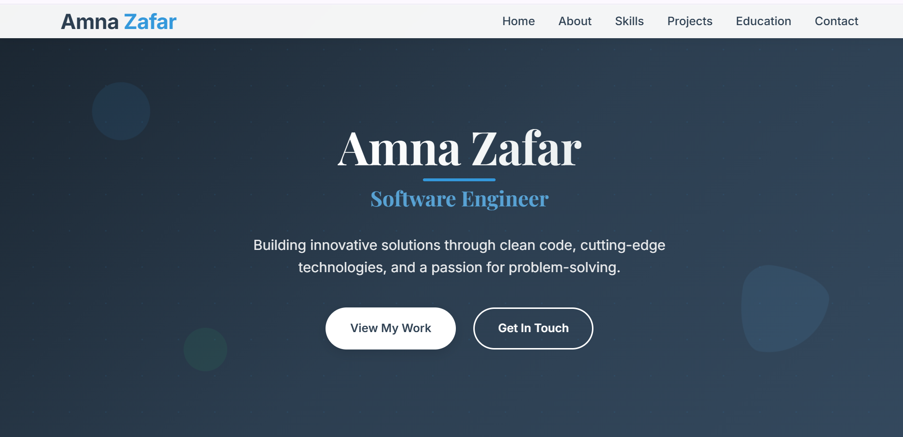

# 🌐 Personal Portfolio Website

Welcome to my personal portfolio!  

This website is built using **HTML**, **CSS**, and **JavaScript**, featuring smooth **animations** and a fully **responsive design** to showcase my work, skills, and contact information.

## 🔗 Live Preview

👉 [View Portfolio Live](https://amna-zafar-portfolio.netlify.app/)  

## 🛠️ Technologies Used

- HTML5
- CSS3 (Flexbox, Grid, Media Queries)
- JavaScript (Vanilla JS)
- CSS Animations & Transitions

## 💡 Features

- Responsive design across all screen sizes
- Smooth animations and transitions
- Interactive sections (navigation, hover effects)
- Project gallery with live preview links
- Contact section with social media integration

## 📸 Preview

* 

## 🚀 How to Use

1. Clone the repository:
   ```bash
   git clone https://github.com/AmnaZafar43/My-Portfolio.git